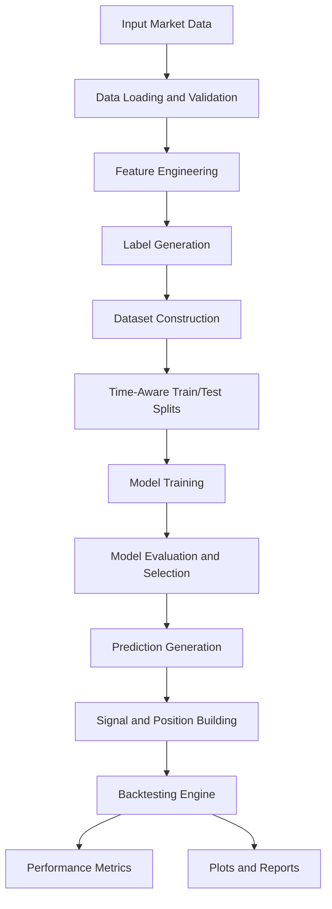

# QuantAuto

<p align="center">
  
</p>


QuantAuto is a Python framework for machine learning-driven trading research. It helps you take time-series market data, validate it, build leakage-aware features and labels, train multiple models, evaluate them with time-aware validation, and run backtests from the resulting predictions.

The framework is designed to make quantitative research faster and more repeatable. Instead of manually wiring together data loading, feature engineering, model training, validation, and portfolio simulation every time, QuantAuto provides one main workflow function that runs the full pipeline with sensible defaults while still allowing advanced configuration.

## Installation

Installation instructions will be added once QuantAuto is available through pip.

```bash
# Placeholder
# pip install quantauto
```

## How To Use

### Data Requirements

QuantAuto expects market data as either a pandas `DataFrame`, a CSV/path-like input, a `LoadedMarketData` object, or a `MultiAssetMarketData` object.

For normal single-asset usage, your data should include:

- A timestamp column or datetime-like index.
- OHLCV columns where possible: `open`, `high`, `low`, `close`, and `volume`.
- Extra numeric columns are allowed and can be used as additional features.
- Rows should be ordered by time, with enough history for feature windows, labels, validation splits, and backtesting.
- Avoid future-looking columns. Any feature that already contains future information can create leakage and unrealistic results.

Recognized timestamp column names include examples like `timestamp`, `time`, `date`, `datetime`, `ts`, `open_time`, and `close_time`.

Recognized OHLCV aliases include examples like:

- Open: `open`, `o`, `open_price`
- High: `high`, `h`, `high_price`
- Low: `low`, `l`, `low_price`
- Close: `close`, `c`, `close_price`, `adj_close`, `price`
- Volume: `volume`, `vol`, `v`, `qty`, `amount`

For multi-asset workflows, data can be provided as multiple symbol-specific datasets. Each symbol should have compatible timestamped data so QuantAuto can align assets and run per-symbol or combined workflows.

### Example Usage

```python
from quantauto.workflows import run_auto

results = run_auto(
    data="path/to/your_market_data.csv",
    target_type="regression",
    target_horizon=1,
    training_time_budget="10m",
    enable_backtest_plots=False,
)

print(results.ml_metrics)
print(results.backtest_results)
```

### Main Function: `run_auto`

`run_auto()` is the main high-level workflow function. It runs the complete research pipeline:

1. Load and validate the input data.
2. Build features.
3. Build labels/targets.
4. Split data into train/test or walk-forward folds.
5. Train candidate models.
6. Select the best model.
7. Convert predictions into trading positions.
8. Run backtests.
9. Return structured results.

Basic import:

```python
from quantauto.workflows import run_auto
```

Current function signature:

```python
run_auto(
    data,
    *,
    target_type="regression",
    target_horizon=1,
    feature_preset="base",
    test_split=0.2,
    walk_forward_folds=1,
    training_time_budget="30m",
    model_ids=None,
    enable_layer2=True,
    label_spec=None,
    label_specs=None,
    purge_bars=0,
    embargo_bars=0,
    execution_shift=1,
    threshold=0.0,
    fee_bps=0.0,
    slippage_bps=0.0,
    backtest_scope="all_test_folds",
    enable_backtest_plots=True,
    backtest_default_plots=("equity_curve", "returns_distribution"),
    backtest_optional_plots=(),
    use_numba_backtest=True,
    continue_on_error=False,
    multi_portfolio="per_symbol_only",
    multi_weighting="equal",
    inv_vol_lookback=20,
    ranking_top_k=1,
    min_common_bars=5,
    verbose=1,
)
```

### `run_auto()` Parameters

- `data`: Input data. Can be a pandas `DataFrame`, a file path, `LoadedMarketData`, or `MultiAssetMarketData`.
- `target_type`: Type of prediction target. Common values are `"regression"` and `"classification"`. Multi-asset ranking workflows may use `"ranking"`.
- `target_horizon`: Number of future bars used to build the prediction target.
- `feature_preset`: Feature preset to use. The default preset is intended for a standard first run.
- `test_split`: Fraction of data reserved for out-of-sample testing when using holdout-style validation.
- `walk_forward_folds`: Number of walk-forward validation folds. Use more folds for stronger time-series validation.
- `training_time_budget`: Maximum training budget. Accepts values like `"10m"`, `"30m"`, numeric minutes, or hour-style strings depending on parser support.
- `model_ids`: Optional list/tuple of specific model IDs to train. Leave as `None` to use the default configured model set.
- `enable_layer2`: Enables or disables layer-2/ensemble-style selection where supported.
- `label_spec`: Optional custom label configuration for a single target.
- `label_specs`: Optional list of custom label configurations for multiple labels.
- `purge_bars`: Number of bars to remove between train/test sections to reduce leakage.
- `embargo_bars`: Number of bars to embargo after test periods to reduce leakage.
- `execution_shift`: Number of bars to shift execution after signal generation. A value of `1` means trades occur after the prediction bar.
- `threshold`: Minimum prediction threshold used when converting predictions into positions.
- `fee_bps`: Trading fee assumption in basis points.
- `slippage_bps`: Slippage assumption in basis points.
- `backtest_scope`: Controls which predictions are backtested. Common values include `"last_fold"`, `"all_test_folds"`, and `"both"`.
- `enable_backtest_plots`: Whether to generate backtest plots.
- `backtest_default_plots`: Default plot names to generate, such as equity curve and returns distribution.
- `backtest_optional_plots`: Additional optional plot names to generate.
- `use_numba_backtest`: Uses Numba acceleration for backtesting when available.
- `continue_on_error`: In multi-asset mode, continue processing other symbols if one symbol fails.
- `multi_portfolio`: Multi-asset portfolio mode. For example, per-symbol only or combined portfolio behavior.
- `multi_weighting`: Weighting method for combined multi-asset portfolios, such as equal weighting.
- `inv_vol_lookback`: Lookback window used for inverse-volatility weighting.
- `ranking_top_k`: Number of top-ranked assets to select in ranking workflows.
- `min_common_bars`: Minimum number of aligned bars required for multi-asset workflows.
- `verbose`: Logging verbosity. Use `0` for quiet runs and higher values for more progress output.

### Example With More Configuration

```python
from quantauto.workflows import run_auto

results = run_auto(
    data="path/to/your_market_data.csv",
    target_type="classification",
    target_horizon=3,
    feature_preset="base",
    test_split=0.2,
    walk_forward_folds=3,
    training_time_budget="30m",
    model_ids=None,
    purge_bars=1,
    embargo_bars=1,
    fee_bps=2.0,
    slippage_bps=1.0,
    backtest_scope="both",
    enable_backtest_plots=True,
)
```

## System Architecture

QuantAuto is organized as a pipeline. The rough flow is:



### Framework Modules

- `quantauto.data`: Loads, normalizes, validates, and aligns market data.
- `quantauto.features`: Builds leakage-aware features and feature presets.
- `quantauto.labels`: Builds classification, regression, and ranking targets.
- `quantauto.models`: Handles model configuration, registries, training, and panel/ranking models.
- `quantauto.validation`: Provides walk-forward validation and model metrics.
- `quantauto.backtesting`: Converts predictions into positions and evaluates trading performance.
- `quantauto.workflows`: Provides the high-level `run_auto()` pipeline.

## Status

QuantAuto is currently in early public development. APIs may change as the package moves toward a stable release.
